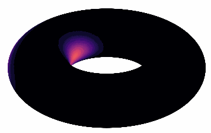

# An Invariant Preserving Sparse Spectral Discretization of the Continuum Equation
Parker Ewen, Lucas Lymburner, Henry Jacobs, Ram Vasudevan<br>
| [Webpage](https://roahmlab.github.io/sparselib_page/) | [Full Paper](https://repo-sam.inria.fr/fungraph/3d-gaussian-splatting/3d_gaussian_splatting_high.pdf)<br>
<p align="center">
  
</p>

This repository contains the *sparselib* implementation associated with the paper "Uncertainty Propagation Using Half-Densities Via Sparse Spectral Discretization on Compact Manifolds".

## Setup
This package can be installed using the pip package installer:

```shell
git clone https://github.com/ParkerEwen5441/sparselib.git
cd sparselib
pip install .
```

## Overview

The codebase has 4 main components:
- A grid object used for computing the hyperbolic Fourier coefficients
- A grid container for storing all grid objects used to approximate the uncertainty and vector fields
- A spectral scheme for computing solutions to the linear advection equation

Any of these components may be modified to suit the user's particular implementation.
Algorithms used in the component implementations are constructive so as to alleviate the curse-of-dimensionality.


## Running

To run the an example script for the 1D example seen in the paper, simply use

```shell
cd scripts
python 1D_example.py
```

Additionally, other scripts are available for the 2D, 3D, and 6D cases.
To run the 2D and 3D cases, there is an additional dependency to plot the uncertainty over the torus:

```shell
pip install s3dlib==1.0.0
```

## Abstract
Uncertainty propagation is a critical component in various applications such as stochastic optimal control, optimal transport, probabilistic inference, and filtering.
This paper frames uncertainty propagation of a dynamical system with compact support thru the lens of advecting a probability density through a vector field via the transport and continuum equations.
These equations exhibit a number of conservation laws.
For example, scalar multiplication is conserved by the transport equation, while positivity of probabilities is conserved by the continuum equation.
Certain discretization techniques, such as particle based methods, conserve these properties, but converge slower than spectral discretization methods on smooth data.
Standard spectral discretization methods, on the other hand, do not conserve the invariants of the transport equation and the continuum equation.
This article constructs a novel sparse spectral discretization technique that conserves these important invariants, namely positivity of probability measure, while simultaneously preserving spectral convergence rates. 
The performance of this proposed method is illustrated on several numerical experiments and the quantitative convergence rate of the proposed approach is derived.

If you use this library, please cite the following work.

<section class="section" id="BibTeX">
  <div class="container is-max-desktop content">
    <h2 class="title">BibTeX</h2>
    <pre><code>@Article{kerbl3Dgaussians,
      author       = {Ewen, Parker and Lymburner, Lucas and Jacobs, Henry and Vasudevan, Ram},
      title        = {Uncertainty Propagation Using Half-Densities Via Sparse Spectral Discretization on Compact Manifolds},
      journal      = {In Submission},
      number       = {1},
      volume       = {1},
      month        = {September},
      year         = {2024},
      url          = {https://roahmlab.github.io/sparselib_page/}
}</code></pre>
  </div>
</section>
